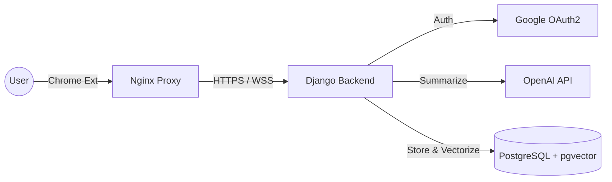

<div align="center">

  <a href="https://github.com/your-username/news-node-knowledge">
    
  </a>
  
  
  
  
  
  

  <br />
  <br />

  

  <h3 align="center">News Node Knowledge</h3>

  <p align="center">
    <b>AI-Powered News Archiver & Knowledge Graph Generator</b>
    <br />
    <br />
    <a href="https://chrome.google.com/webstore/detail/YOUR_EXTENSION_ID"><strong>Download Extension »</strong></a>
    <br />
    <br />
    <a href="#demo">View Demo</a>
    ·
    <a href="#issues">Report Bug</a>
    ·
    <a href="#contact">Request Feature</a>
  </p>
</div>

<details>
  <summary>Table of Contents</summary>
  <ol>
    <li><a href="#about-the-project">About The Project</a></li>
    <li><a href="#architecture">System Architecture</a></li>
    <li><a href="#built-with">Built With</a></li>
    <li><a href="#getting-started">Getting Started</a></li>
    <li><a href="#project-structure">Project Structure</a></li>
    <li><a href="#features">Key Features</a></li>
    <li><a href="#license">License</a></li>
    <li><a href="#contact">Contact</a></li>
  </ol>
</details>

---

## 📖 About The Project

> **"Stop drowning in information. Start building your knowledge."**

**News Node Knowledge** is a comprehensive platform designed to revolutionize how we consume digital news. By combining a browser-based **Chrome Extension** with a robust **Django backend**, it bridges the gap between passive reading and active knowledge management.

Instead of fleeting news consumption, this tool allows users to:
1.  **Summarize** complex articles instantly using Generative AI (OpenAI GPT).
2.  **Archive** content securely into a personal database.
3.  **Visualize** the flow of events using a Knowledge Graph.
4.  **Search** through archived news using semantic understanding (Vector Search).

### 📸 Demo

| AI Summarization (Popup) | Dashboard & Graph |
|:-----------------------:|:-----------------:|
| 
 | 
 |

---

## 🏗 System Architecture

The system utilizes a microservices-like architecture containerized with Docker.



* **Frontend**: A Manifest V3 Chrome Extension that interacts with the current tab.
* **Backend**: Django REST Framework serving APIs for auth, summarization, and data retrieval.
* **Database**: PostgreSQL with `pgvector` extension for storing vector embeddings of news articles.
* **Infrastructure**: Hosted on AWS Lightsail, orchestrated via Docker Compose with Nginx as a reverse proxy/SSL terminator.

---

## 🛠 Built With

### Frontend (Chrome Extension)
*  **ES6+**
*  **HTML5 & CSS3**
* **Manifest V3**
* **Google Identity Services (OAuth2)**

### Backend (Server)
*  **Python 3.11**
*  **Django REST Framework**
*  **Gunicorn**

### Database & AI
*  **PostgreSQL**
* **pgvector** (Vector Similarity Search)
*  **GPT-4o-mini**

### Infrastructure
*  **Docker & Docker Compose**
*  **Nginx Proxy Manager**
*  **AWS Lightsail**

---

## 🚀 Getting Started

To set up a local development environment, follow these steps.

### Prerequisites
* Docker & Docker Compose installed
* Git installed
* OpenAI API Key

### Installation

1.  **Clone the repository**
    ```bash
    git clone [https://github.com/your-username/news-node-knowledge.git](https://github.com/your-username/news-node-knowledge.git)
    cd news-node-knowledge
    ```

2.  **Configure Environment Variables**
    Create a `.env` file in the root directory based on the example.
    ```bash
    cp .env.example .env
    ```
    Then, edit the `.env` file with your credentials:
    ```ini
    # .env configuration
    DEBUG=1
    SECRET_KEY=your_secret_key_here
    ALLOWED_HOSTS=localhost 127.0.0.1
    
    DB_NAME=news_db
    DB_USER=postgres
    DB_PASSWORD=your_db_password
    DB_HOST=db
    
    OPENAI_API_KEY=sk-proj-your-openai-key
    ```

3.  **Run with Docker**
    ```bash
    docker-compose up -d --build
    ```

4.  **Load Extension (Developer Mode)**
    * Open Chrome and navigate to `chrome://extensions`.
    * Toggle **Developer mode** (top right corner).
    * Click **Load unpacked**.
    * Select the `extension` folder from this repository.

---

## 📂 Project Structure

```text
.
├── backend/                # Django Backend Application
│   ├── config/             # Project Settings (Settings, URLs)
│   ├── news/               # News App (Models, Views, Serializers)
│   ├── manage.py
│   └── Dockerfile
├── extension/              # Chrome Extension Source
│   ├── manifest.json       # Manifest V3 Configuration
│   ├── popup.html          # Extension UI
│   ├── popup.js            # Frontend Logic
│   └── icons/
├── nginx/                  # Nginx Configuration
├── docker-compose.prod.yml # Production Orchestration
├── requirements.txt        # Python Dependencies
└── README.md
```

---

## 🔥 Key Features

- [x] **Secure Authentication**: Seamless login via Google OAuth2 with secure token management.
- [x] **AI Summarization**: Extracts key points, keywords, and sentiment from any news article page.
- [x] **Knowledge Graph**: Visualizes relationships between archived news topics.
- [x] **Semantic Search**: Utilizes `pgvector` to find news articles based on context, not just keywords.
- [x] **Responsive Dashboard**: A dedicated web interface to manage and review archived news.

---

## 📜 License

Distributed under the MIT License. See `LICENSE` for more information.

---

## 📧 Contact

**Project Lead** - [Your Name]
<br />
**Email** - [Your Email]
<br />
**Project Link** - [https://github.com/your-username/news-node-knowledge](https://github.com/your-username/news-node-knowledge)

<p align="right">(<a href="#readme-top">back to top</a>)</p>
