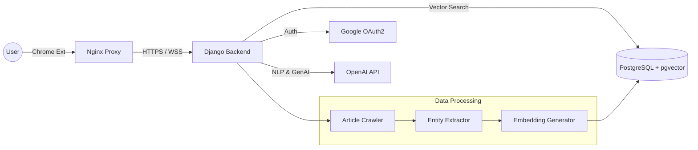

<div align="center">
  <a href="https://github.com/your-username/news-node-knowledge">
    
  </a>
  
  
  
  
  

  <br />
  <br />

  


  
  <h3 align="center">News Node Knowledge</h3>

  <p align="center">
    <b>Your Personal AI Librarian & Knowledge Graph Generator</b>
    <br />
    <br />
    <a href="https://chrome.google.com/webstore/detail/YOUR_EXTENSION_ID](https://chromewebstore.google.com/detail/news-node-knowledge-ai-ne/onfldbkpmmcaepamcdfbkehekmpbmonj"><strong>Download Extension »</strong></a>
    <br />
    <br />
    <a href="#demo">View Demo</a>
    ·
    <a href="#issues">Report Bug</a>
    ·
    <a href="#contact">Request Feature</a>
  </p>
</div>

<details>
  <summary>Table of Contents</summary>
  <ol>
    <li><a href="#about-the-project">About The Project</a></li>
    <li><a href="#new-features">✨ New Features (v2.0)</a></li>
    <li><a href="#architecture">System Architecture</a></li>
    <li><a href="#built-with">Built With</a></li>
    <li><a href="#getting-started">Getting Started</a></li>
    <li><a href="#project-structure">Project Structure</a></li>
    <li><a href="#license">License</a></li>
    <li><a href="#contact">Contact</a></li>
  </ol>
</details>

---

## About The Project

> **"Turn fleeting news into permanent knowledge."**

**News Node Knowledge** is a comprehensive AI-powered knowledge management platform. It is not just a bookmarking tool—it is your personal **AI Librarian**. 

By seamlessly integrating a Chrome Extension with a powerful Django/pgvector backend, this platform transforms your daily fragmented news consumption into a permanent, interconnected, and visually mapped knowledge asset. It guides users through a complete cycle of learning: **Instant Summarization ➔ Secure Archiving ➔ Visual Connection ➔ AI Recommendation.**

---

## ✨ Core Features & Workflow

### 1. 1-Click AI Summarization (Chrome Extension)
Experience frictionless knowledge gathering right from your browser.
* **Instant 3-Line Summaries:** Utilizes OpenAI's GPT models to instantly distill long, complex articles into 3 key bullet points.
* **Frictionless Archiving:** With a single click, metadata (original URL, thumbnails, categories) and AI summaries are securely transmitted and saved to your personal backend database.

### 2. Personal Knowledge Archive (My Library)
Your private, permanent database for all consumed information.
* **Reading Log Management:** Automatically tracks what you've read, categorized by topics and reading status.
* **Permanent Summaries:** Keeps your summarized content safely archived, ensuring you never lose access to crucial information even if the original article is deleted or paywalled.

### 3. Interactive Knowledge Graph

A dynamic, visual map that reveals how your saved articles are interconnected, moving beyond simple list views.
* **Category Clusters (Blue Lines):** Groups articles into intuitive clusters based on their primary topics (e.g., Tech, Economy).
* **Semantic Context Links (Red Dashed Lines):** Powered by `pgvector`, it calculates cosine similarity between text embeddings. Articles with a highly matched context (>85% similarity) are connected, revealing hidden relationships across different categories.
* **Shared Entity Links (Green Dashed Lines):** Using NLP Named Entity Recognition (NER), it connects articles sharing multiple key entities (e.g., `#OpenAI`, `#SamAltman`), explicitly showing the intersection of events.

### 4. The AI Librarian (Personalized Dashboard)
Forget the boring list view. Your dashboard is a customized **Classic Newspaper Layout** tailored daily by an AI Librarian.
* **Knowledge Time Capsule:** Resurfaces meaningful past reads to reinforce your memory and connect past events to present contexts.
* **Context Bridge (Origin-Verdict):** Places the initial "Spark" (Origin) of an issue side-by-side with its current status (Verdict), helping you grasp the full, multi-dimensional storyline.
* **Taste Stream & Discovery:** Analyzes your cumulative reading vectors to curate deep-dive recommendations matching your interests, while also suggesting "Discovery" keywords to broaden your horizons.
---

## Demo

### 1. 1-Click AI Summarization (Chrome Extension)
*Instantly extracts 3-line summaries, keywords, and named entities (NER) from any news article while browsing.*


### 2. Interactive Knowledge Graph
*Visualizes your reading history. Notice the Category Clusters (Blue), Semantic Context Links (Red dashed), and Shared Entity Links (Green dashed with #tags).*


### 3. The AI Librarian Dashboard (Newspaper Theme)
*Your personalized daily newspaper. Features the Knowledge Time Capsule, Taste Stream, and newly discovered topics based on your reading vector.*


### 4. Knowledge Context Bridge
*Tracing the lineage of a story. The modal connects the initial "Origin" of an event directly to its current "Verdict" or expert analysis.*


---

## System Architecture

The system utilizes a microservices-like architecture containerized with Docker.



* **Frontend**: Chrome Extension (Manifest V3) & Dashboard (Tailwind CSS + Chart.js).
* **Backend**: Django REST Framework serving APIs for auth, summarization, and RAG (Retrieval-Augmented Generation).
* **Database**: PostgreSQL with `pgvector` for semantic search and `JSONB` for NER data.

---

## 🛠 Built With

### Frontend

* **ES6+**
* **Tailwind CSS (New)**
* **HTML5 & CSS3**
* **Chart.js** (Data Visualization)

### Backend

* **Python 3.11**
* **Django REST Framework**

### Database & AI

* **PostgreSQL**
* **pgvector** (Vector Similarity Search)
* **GPT-4o-mini**

### Infrastructure

* **Docker & Docker Compose**
* **Nginx Proxy Manager**
* **AWS Lightsail**

---

## Getting Started

To set up a local development environment, follow these steps.

### Prerequisites

* Docker & Docker Compose installed
* OpenAI API Key

### Installation

1. **Clone the repository**
```bash
git clone [https://github.com/your-username/news-node-knowledge.git](https://github.com/your-username/news-node-knowledge.git)
cd news-node-knowledge

```


2. **Configure Environment Variables**
Create a `.env` file in the root directory.
```bash
cp .env.example .env

```


Edit the `.env` file:
```ini
# .env configuration
DEBUG=1
SECRET_KEY=your_secret_key_here
ALLOWED_HOSTS=localhost 127.0.0.1

DB_NAME=news_db
DB_USER=postgres
DB_PASSWORD=your_db_password
DB_HOST=db

OPENAI_API_KEY=sk-proj-your-openai-key

```


3. **Run with Docker**
```bash
docker-compose up -d --build

```


4. **Load Extension (Developer Mode)**
* Open `chrome://extensions`.
* Toggle **Developer mode**.
* Click **Load unpacked** and select the `extension` folder.


---

## Project Structure

```text
.
├── backend/
│   ├── news/
│   │   ├── services/       # Business Logic (Crawler, AI, RAG)
│   │   ├── views/          # API Controllers
│   │   └── models.py       # DB Schema (Article, Entity, etc.)
│   └── ...
├── extension/              # Chrome Extension
│   ├── popup.html
│   └── popup.js
├── nginx/
├── docker-compose.prod.yml
└── README.md

```

---

## License

Distributed under the MIT License. See `LICENSE` for more information.

---

## Contact

**Project Lead** - Youngho Shin
<br />
**Email** - younghoshin2001@gmail.com
<br />
**Project Link** - [https://github.com/dudghyoungho/news-node-knowledge](https://github.com/dudghyoungho/news-node-knowledge)

<p align="right">(<a href="#readme-top">back to top</a>)</p>
