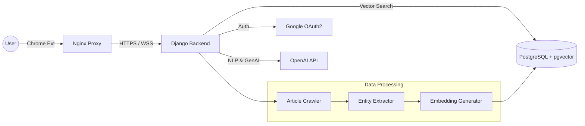

<div align="center">

  <a href="https://github.com/your-username/news-node-knowledge">
    
  </a>
  
  
  
  
  

  <br />
  <br />

  


  
  <h3 align="center">News Node Knowledge</h3>

  <p align="center">
    <b>Your Personal AI Librarian & Knowledge Graph Generator</b>
    <br />
    <br />
    <a href="https://chrome.google.com/webstore/detail/YOUR_EXTENSION_ID"><strong>Download Extension »</strong></a>
    <br />
    <br />
    <a href="#demo">View Demo</a>
    ·
    <a href="#issues">Report Bug</a>
    ·
    <a href="#contact">Request Feature</a>
  </p>
</div>

<details>
  <summary>Table of Contents</summary>
  <ol>
    <li><a href="#about-the-project">About The Project</a></li>
    <li><a href="#new-features">✨ New Features (v2.0)</a></li>
    <li><a href="#architecture">System Architecture</a></li>
    <li><a href="#built-with">Built With</a></li>
    <li><a href="#getting-started">Getting Started</a></li>
    <li><a href="#project-structure">Project Structure</a></li>
    <li><a href="#license">License</a></li>
    <li><a href="#contact">Contact</a></li>
  </ol>
</details>

---

## About The Project

> **"Turn fleeting news into permanent knowledge."**

**News Node Knowledge** is not just a bookmarking tool—it is your personal **AI Librarian**. By combining a Chrome Extension with a powerful Django backend, it transforms how you consume, organize, and recall digital information.

It goes beyond simple summarization by creating a **Knowledge Graph** of your reading history, connecting related events, and presenting them in a curated **Newspaper Layout** tailored specifically to your interests.

---

## ✨ New Features (v1.5.0)

### 1. 📰 The AI Librarian (Newspaper View)
Forget the boring list view. The dashboard now features a **Classic Newspaper Layout** powered by **Tailwind CSS**.
* **Time Capsule**: Revisit past articles with a "On this day" style memory card.
* **Taste Stream**: AI-curated recommendations based on your reading vector depth.
* **Discovery**: Automatically finds new topics and keywords you might be interested in.

### 2. 🌉 Knowledge Context Map (The Bridge)
Understanding the *context* is as important as the news itself.
* **Origin (Top)**: Shows the "Spark" or the initial event that caused the news.
* **Verdict (Bottom)**: Shows the current status or expert analysis.
* **Connection**: Visualizes the lineage between articles to help you see the bigger picture.

### 3. 🧠 Enhanced NER (Named Entity Recognition)
* Automatically extracts **People (PERSON)**, **Organizations (ORG)**, and **Locations (LOC)** from articles during crawling.
* Builds a richer database for precise searching and filtering.

---

## 📸 Demo

### 1. The AI Librarian Dashboard (Newspaper Theme)
*A personalized daily newspaper generated from your reading history.*


### 2. Knowledge Bridge Modal
*Tracing the lineage of a story from Origin to Verdict.

### 3. Extension Popup
*Instant summarization and entity extraction.*


---

## System Architecture

The system utilizes a microservices-like architecture containerized with Docker.



* **Frontend**: Chrome Extension (Manifest V3) & Dashboard (Tailwind CSS + Chart.js).
* **Backend**: Django REST Framework serving APIs for auth, summarization, and RAG (Retrieval-Augmented Generation).
* **Database**: PostgreSQL with `pgvector` for semantic search and `JSONB` for NER data.

---

## 🛠 Built With

### Frontend

* **ES6+**
* **Tailwind CSS (New)**
* **HTML5 & CSS3**
* **Chart.js** (Data Visualization)

### Backend

* **Python 3.11**
* **Django REST Framework**

### Database & AI

* **PostgreSQL**
* **pgvector** (Vector Similarity Search)
* **GPT-4o-mini**

### Infrastructure

* **Docker & Docker Compose**
* **Nginx Proxy Manager**
* **AWS Lightsail**

---

## Getting Started

To set up a local development environment, follow these steps.

### Prerequisites

* Docker & Docker Compose installed
* OpenAI API Key

### Installation

1. **Clone the repository**
```bash
git clone [https://github.com/your-username/news-node-knowledge.git](https://github.com/your-username/news-node-knowledge.git)
cd news-node-knowledge

```


2. **Configure Environment Variables**
Create a `.env` file in the root directory.
```bash
cp .env.example .env

```


Edit the `.env` file:
```ini
# .env configuration
DEBUG=1
SECRET_KEY=your_secret_key_here
ALLOWED_HOSTS=localhost 127.0.0.1

DB_NAME=news_db
DB_USER=postgres
DB_PASSWORD=your_db_password
DB_HOST=db

OPENAI_API_KEY=sk-proj-your-openai-key

```


3. **Run with Docker**
```bash
docker-compose up -d --build

```


4. **Load Extension (Developer Mode)**
* Open `chrome://extensions`.
* Toggle **Developer mode**.
* Click **Load unpacked** and select the `extension` folder.


---

## Project Structure

```text
.
├── backend/
│   ├── news/
│   │   ├── services/       # Business Logic (Crawler, AI, RAG)
│   │   ├── views/          # API Controllers
│   │   └── models.py       # DB Schema (Article, Entity, etc.)
│   └── ...
├── extension/              # Chrome Extension
│   ├── popup.html
│   └── popup.js
├── nginx/
├── docker-compose.prod.yml
└── README.md

```

---

## License

Distributed under the MIT License. See `LICENSE` for more information.

---

## Contact

**Project Lead** - Youngho Shin
<br />
**Email** - younghoshin2001@gmail.com
<br />
**Project Link** - [https://github.com/dudghyoungho/news-node-knowledge](https://github.com/dudghyoungho/news-node-knowledge)

<p align="right">(<a href="#readme-top">back to top</a>)</p>
